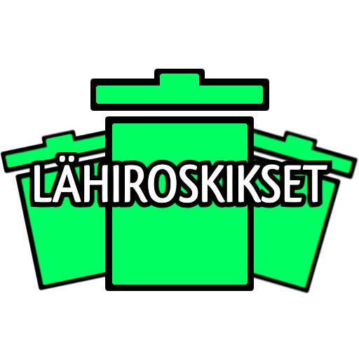

<!--LOGO -->
<br/>
<p align="center">
    <a href="https://github.com/Garbage-people/roskisAppFront">
    
    </a>
</p>

## Lähiroskikset Description
This application has been created as a group project for Haaga-Helia's course Software Project II (Ohjelmistoprojekti II). Lähiroskikset provides the user a map and shows the user icons of trashcans which can be found nearby. The idea of the application is for the user to find trashcans easily. With the application the user is able to reduce littering in Helsinki. The map used in this project is by OpenStreetMap.

On the map there can be seen three different coloured icons for trashcans based on their statuses. You, as the user, are able to change the statuses of trachcans, if you notice a trashcan which is full. This will make the use of the application more enjoyable and accurate for all users. If you are somewhere around Helsinki and you find a trashcan which is not on the map, you can add it by using the adding functionality. Also on the top right corner you can find an info button to ensure that the use of the application is clear to everyone.

The data for this project has been provided by the City of Helsinki.

You can access the application with your mobile phone here: 


***
<kbd>  </kbd> <kbd>  </kbd> <kbd>  </kbd> <kbd>  </kbd>

<kbd>  </kbd> <kbd>  </kbd> <kbd>  </kbd> <kbd>  </kbd> <kbd>  </kbd>

***
## Technologies Used on This Project

* [React+Vite](https://vitejs.dev/guide/)
* [Rest](https://spring.io/projects/spring-restdocs)
* [OpenStreetMap](https://www.openstreetmap.org/about)
* [ReactLeaflet](https://react-leaflet.js.org/)
* The application has been deployed to [CSC Rahti](https://rahti.csc.fi/): https://roskisappfront-frontend-garbagepeople.rahtiapp.fi/

## Getting Started Locally

The first step in using the application locally is to download or git clone it to your device.
```
git clone https://github.com/Garbage-people/roskisAppFront.git
```
In addition to installing the application locally, it is necessary to run command:
```
 npm install. 
```

Before you are able to run the necessary command, you might need to install Node.js. In order to install Node.js please turn to its [documentation](https://nodejs.org/docs/latest/api/).

After running the necessary command and also installing the backend of this application, run the command down below. 

```
 npm run dev 
```

It will start the application. The port which is used when running locally is localhost:5173.

The backend for this project can be found here: https://github.com/Garbage-people/roskisAppBack

## Quick Guide to LähiRoskikset

### The Colours of the Trashcans

The trashcans can be available, full or out of service. Each of these statuses are described with different coloured trashcans to showcase trashcans fill rate.

A green trashcan is used to showcase if a trashcan is available.

A red trashcan shows if the trashcan is full.

A grey trashcan with black cross over it, is used when a trashcan is out of service.

### Adding Trashcans in the App

In the application you are able to add trashcans. The adding ability is so that if you find a trashcan in real life which doesn't have an icon on the map you can add one.

However to minimize the misuse of the application, you are only able to add trashcans to your location. You are not given the ability to choose a spot for the trashcan. 

When adding a trashcan, the system will check if there is already an icon in that spot. If the icon to add is too close to an already existing icon, the adding will not be done. 


## Authors
Jani Hänninen
Aleksi Hyppönen
Eino Hirvi
Aaron Hirsimäki
Minea Aaltonen

## License
This project is licensed under the MIT License - see the LICENSE.md file for details
